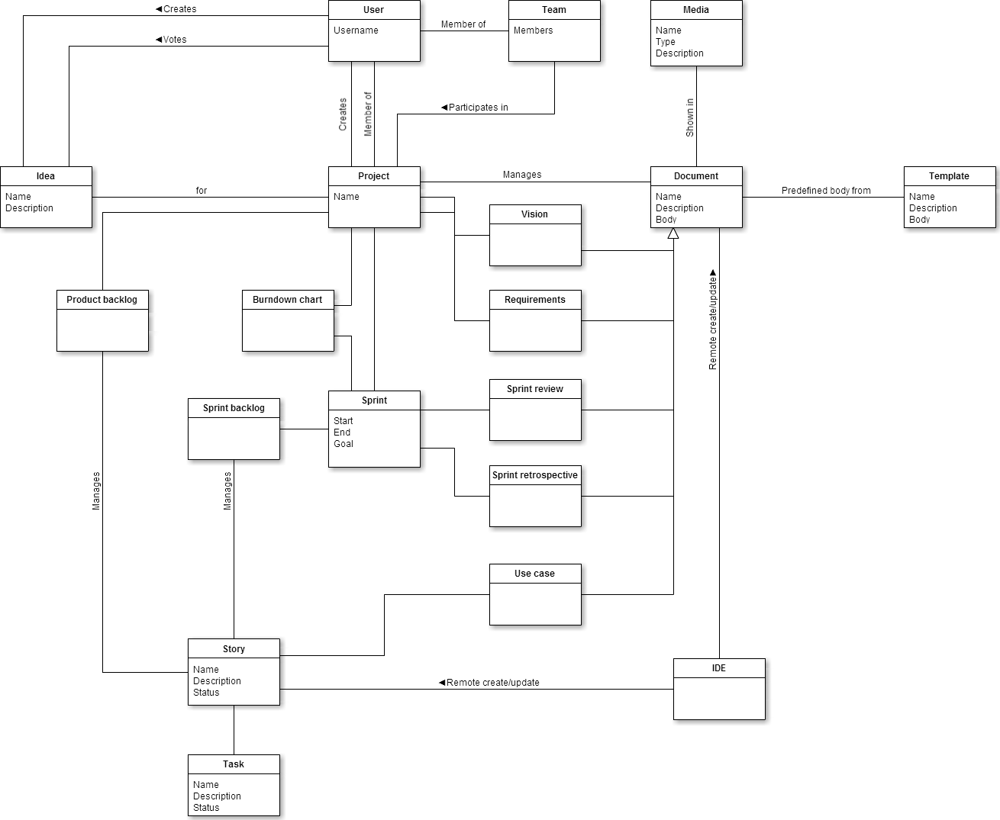

#Projise
##Inledning
Projise är ett kollaborativt projekthanteringssystem som förenklar hantering av projekt, uppgifter och dokument. Liknande applikationer finns i mängder, av de jag testat är dock kalkylblad och dokument fortfarande att föredra. Visionen är därför ett väldigt enkelt och lätthanterligt, men intelligent system. Systemet lär upp användare, hjälper till med uppgiftsbedömning, varnar för problem, fyller i data där det är möjligt samt prioriterar och strukturerar presentation av information.

##Domänmodell

Utförligare modeller: [Länk](documentation/domain.md)  
Modellerna beskriver inte applikationen utan är uppritade som ett mål att arbeta mot, det finns därför vissa skillnader.

##Serversida
Startsida, kontohantering, rapporter och första vy för SPA utnyttjar Asp.net MVC, vyer som hämtas in av SPA är statisk html och dess data hämtas från Asp.net Web API. SignalR används för synkronisering, MongoDB används för all användar- och projektdata, Entity framework(MSSQL) sköter data från Google Contacts och Google Calendar. Kalender- och kontaktdata hämtas om befintlig data är äldre än en dag. Klientsidan hämtar data vid första förfrågan, denna hålls sedan synkroniserad med SignalR. Data som hämtas från externa APIer är tänkt att vara en bonus i kalendern, vars huvudsakliga syfte är att presentera viktiga projektdatum. Om fel uppstår på servern har jag en notifikationsservice på klienten som fångar upp dessa och presenterar för användaren.

##Klientsida
SPA är till största del Angular, dess router är utbytt mot UI Router och Showdown används för visning av Markdown. Till startsida, kontohantering och rapporter används Bootstrap och Jquery. Cache på klientsidan sköts av Angular och UI Router. Data hämtas bara en gång och synkroniseras sedan med SignalR.

##Säkerhet
Det har varit svårt att hitta bra resurser för MongoDB med C#, jag har testat en del och inte lyckats få JavaScript att köras i databasen. Min uppfattning är att JavaScript försvinner eller görs om till strängar när JSON görs om till C# objekt. Mot MSSQL används Entity framework som löser de attackmöjligheter jag känner till. Angular löser problem med presentation av data, förutsatt att strängar placeras korrekt och att osäker bindning undviks. Över-/underpostning är en vanlig attack mot ASP.net, jag har därför försökt hålla all inkommande data väldefinierad. Ett problem specifikt för denna applikation är att begränsa tillgång till data till egna projekt, av denna anledning har jag försökt begränsa de platser där detta kan ändras. Aktivt projekt hämtas alltid från användarobjekt hämtat från databas, detta fält kan sedan bara ändras vid projektaktivering. Vid projektaktivering görs en kontroll att man faktiskt tillhör projektet. Troligen finns det också attacker riktade mot SignalR, förmodligen då att man kan fånga upp någon annan grupps data och på så vis se data man inte har rättighet till. För att skydda mot CSRF sätts en token(XSRF-Token) som Angular läser och skickar med som headern(X-XSRF-Token) i alla requests, denna kontrolleras sedan vid alla förfrågningar. Det finns också diverse varianter av man in the middle attacker för datastöld och för externa apier även att felaktig data hämtas(kontroll av format görs, vet inte vad för ytterligare kontroller som skulle kunna göras). Lockout finns som skydd mot bruteforce attacker för inloggning, lösenord hashas och saltas.

Säkerhetsbrister finns troligen även i något/flera av de bibliotek som används. Det finns garanterat säkerhetsluckor, både från saker jag missat och brister från bibliotek jag använt. Förhoppningen är snarare att en attack skulle kräva tillräckligt engagemang för att göra den ointressant sett till tjänstens värde.

##Prestanda
Bundling i Asp.net används för all css och js, vid release mode konkateneras, komprimeras och versionshanteras dessa. Detta har också utnyttjats för att skapa ett script som tar innehållet i samtliga partiella vyer och placerar i Angulars $templateCache. En del material hämtas också från CDN, fler av biblioteken som används finns tillgängliga via CDN, men har inte hunnit sätta mig in i hur detta hanteras med bundling. 

Att göra applikationen skalbar skulle kräva backend för SignalR, förslagsvis med Redis paketet som finns tillgängligt på nuget. Sharding och replikering skulle behöva läggas till för MongoDB. Databaserna skulle behöva en översyn av indexering. En del kompromisser har gjorts för att förenkla med MongoDB, det skulle exempelvis vara effektivare att ha en lista med projekt på användaren, istället för att som nu leta efter användarid i projektens användarlistor. Detta skulle leda till långsammare skrivning för ändring av viss projektdata, men gränssnitt kan uppdateras innan det är gjort. ProjektId borde användas som shardkey. Det skulle också vara effektivt att koppla vilken applikationsserver som används till projektId, backend för SignalR kan då undvikas.

Dokumenthanteringen är ett riktigt stort problem, hela dokumentet skickas när det sparas. Det hade varit betydligt effektigare att bara skicka operationer och att då utnyttja operational transformation.

#Offline-first
Detta bör också ses som en optimering, Appcache har utnyttjats för att spara applikationen lokalt. För att inte hämta data i onödan eller störa de serverrenderade sidorna sätts Appcache när SPA laddas. En fallback sätts här också i form av en route från startsida till SPA. Manifest genereras av .net utifrån filer i bundles vid debug och direkt mot bundles vid release. Vid debug sätts en datumsträng för att undvika cache.

Status från SignalR används för att hålla reda på om användaren är online eller inte (det är bara kopplingen mot servern som är intressant).

###Anrop
För att fånga upp lyckade/misslyckade anrop används interceptor för Angulars $httpProvider.

####GET
Lyckade anrop sparas i localstorage och vid misslyckade anrop görs försök att hämta data därifrån.

####POST/PUT
Misslyckade anrop sparas i localstorage och dess data skickas till synkkomponenten för att uppdatera gränssnitt. För att kunna illustrera vilken data som är ur synk sätts en variabel på dessa objekt.

När koppling till servern upptäcks gås listan från localstorage igenom och dessa skickas anrop på nytt. Lyckas uppdateringen kommer synkkomponenten då uppdatera gränssnittet och ta bort variabeln för att objektet är ur synk.

Vid lyckad uppdatering tar synkkomponenten beteckningen för att objektet är ur synk och uppdaterar gränssnittet.

####DELETE
För att minska riskerna för dataförluster vid fel är alla möjligheter till radering avstängt vid arbete offline.

###Synkronisering
SignalR buffrar meddelanden för att garantera utskick, vid kortare avbrott skickas allt som missats vid återanslutning. Har klienten inte varit ansluten eller avbrottet varat för länge görs istället en uppdatering när anslutning upptäcks. Detta innebär också att en kontroll för att man verkligen är inloggad gjorts och cookie/token sätts. När anslutning sedan upptäcks igen körs genomgången av de ändringar som utförts medan man varit offline.

####Problem
Omladdning av sidan för att på nytt hämta data via nätverk är en riktigt dålig lösning, projektaktivering har samma problem. Problemet är att jag behöver tvinga resolve på routes att göras på nytt och jag har bara hittat lösning för detta på antingen enskild route, eller ändra inställning så att det alltid är ny data som hämtas. Inställningen skulle kunna ändras programmatiskt, men frågan är då istället när det ska ändras tillbaka. Möjligen att lyssna efter event från samtliga providerobjekt och att ändra när alla kommit. Vid projektaktivering behöver gruppbyte i SignalR också göras. 

Kontroll för om data ändrats sedan läsning saknas, en lösning med optimistic concurrency hade varit lämplig. Versionshantering på samtliga objekt, och om versionsnummer inte stämmer så avbryts operationen och ett felmeddelande lämnas till användaren. Istället för detta felmeddelande borde en konfliktlösning visas, formulär med skickad data visas parallellt med den data som upptäcktes i databasen. För online-läge hade det också varit lämpligt att markera uppgifter någon arbetar med som låsta.

##Reflektion
Mashup blev misslyckat, en koppling till google calendar kändes vettig, men kom aldrig på något bra att kombinera det med och lade till kontaktdata för att uppfylla kravet på att kombinera datakällor. Tänkte också använda kontaktdata till att underlätta vid inbjudan, men som med mycket annat så har jag helt enkelt inte hunnit. Först gick det åt flera dagar på att försöka komma fram till hur jag skulle kombinera en NoSQL databas med kravet på att använda Entity framework; jag letade efter providers för MongoDB, försökte hitta andra databaser med stöd och satte mig in i hur BrightstarDB fungerade och fick sedan tipset att bara använda Entity framework till en delmängd av datalagring. 

MongoDB blev källa till en del bekymmer, framförallt ObjectId och dess konvertering mellan JSON, BSON och C# objekt och var i ramverket detta hände. Det var svårt att hitta bra information och med alla skillnader mellan C# driver och NodeJS driver hade jag inte särskilt stor nytta av tidigare erfarenhet av MongoDB.

Det finns mycket kvar jag skulle vilja göra:
* Lösa alla problem som redan nämnts
* Kompilering av SASS med Web Essentials
* Enhetstester i VS med Chutzpah
* Tester med Protractor
* Test av backend
* Arbeta vidare mot de modeller som finns uppritade och lägga till de features som nämnts
* Lösa kontinuerlig integration likt den process som finns med Travis i projektet jag utgått från
* Statistik, visa diagram, privata meddelanden, röstkommunikation och bygga styrningen från IDE.

Teknikkombinationen har trots bekymmer med MongoDB fungerat väldigt bra. Många fördelar med C# beror på utvecklingsmiljö och den hjälp man får av kompilator.

##Risker
Tekniskt och säkerhetsmässigt tror jag att jag fått med det mesta under tidigare rubriker, tycker inte heller att det finns något direkt etiskt problem. En detalj är att jag inte borde be om rättigheter till kontakt- och kalenderdata förrän användare aktivt valt att visa denna data ihop med annan kalenderdata.

Kalenderns huvudsyfte är att presentera projektets kalenderdata, data från APIer är därför endast en bonus. Det känns därför inte som något större problem om tjänsten skulle stängas ner. Ekonomiskt borde det inte heller kunna bli något problem, uppnår datamängderna en punkt där det faktiskt kostar en del finns det förmodligen goda möjligheter att tjäna mer pengar på den egna tjänsten, alternativt plocka bort denna data.

##Betygshöjande
Trots brister med offline first och bristande kodkvalitet i socket.service.js är det förmodligen offline first och synkronisering som är de mest intressanta komponenterna. Storleken på applikationen har lett till många minus pga tidsbrist, så jag hoppas att det samtidigt är ett plus. Jag har inte lyckats köra mina enhetstester inuti VS, men det finns en hel del enhetstester för js, täckningsrapport skapas om karma start körs i foldern med karma.conf.js.
